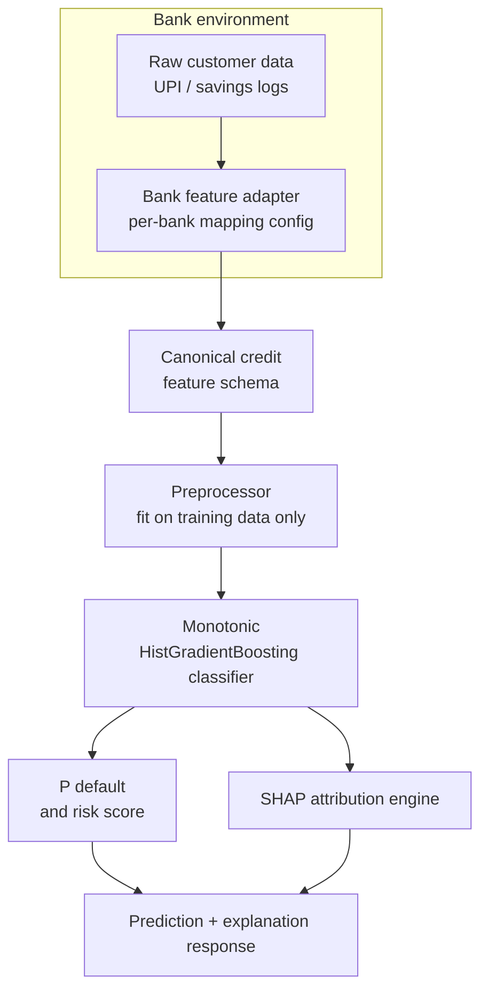

<div align="center">

# Explainable Credit Scoring

**Transparent, bank-deployable credit risk scoring for gig and informal workers, built on alternative data.**

[](https://www.python.org/)
[](https://fastapi.tiangolo.com/)
[](https://react.dev/)
[](https://scikit-learn.org/)
[](https://shap.readthedocs.io/)
[](https://optuna.org/)

</div>

---

## Overview

Millions of gig workers, delivery partners, and micro-vendors have no credit bureau history, so they are rejected by default. Their cash flow tells a different story: income consistency, UPI activity, utility punctuality, and recharge regularity are all strong signals of repayment behaviour.

This project scores credit risk from those signals using a **monotonic gradient boosting model**, and explains every decision with **SHAP**. Each score comes with the factors that raised or lowered it, and each prediction respects domain logic (for example, paying utilities on time can never *increase* predicted risk).

> **Research question:** Can alternative behavioural indicators, modelled with monotonic gradient boosting, deliver high predictive accuracy for gig-worker default risk while remaining explainable and demographically fair?

## Key Features

- **Monotonic constraints** that encode domain logic directly in the model
- **Per-applicant SHAP explanations** showing risk-increasing and protective factors
- **Bank-adaptable schema layer** that maps a bank's own column names to one canonical feature contract
- **Fairness audit** using the Disparate Impact Ratio (80% rule) across gender and city tier
- **Optuna Bayesian tuning** with stratified 5-fold CV on the training split only, to prevent test leakage
- **REST API** for single, batch, CSV, and bank-payload scoring
- **Interactive dashboard** for scoring, batch upload, a UPI simulator, and a model and fairness card

## Data Provenance

Please read this before interpreting any result.

| Dataset | Type | Purpose |
| :--- | :--- | :--- |
| **Synthetic UPI gig-worker data** (2,500 applicants; a 100k variant is also included) | Simulated | Demonstrates the full pipeline. Generated by `UPIGigWorkerSimulator`. **Not real bank data.** |
| **UCI Default of Credit Card Clients** (30,000 records, 24 features) | Real | Public benchmark for real-label validation. Source: [UCI ML Repository](https://archive.ics.uci.edu/dataset/350/default+of+credit+card+clients) |

Real UPI and bank data cannot be obtained for this project because of privacy regulation, so gig-worker results should be read as a **proof of concept**. The UCI dataset covers traditional card holders, not gig workers, so it validates the modelling approach rather than the gig-worker use case.

Two further points of interpretation:

- The **Creditworthiness Score** is a project-defined transformation of the model's default probability. It is **not** a CIBIL or FICO score.
- **SHAP values** describe how features contribute to the model's prediction. They are **not** causal evidence about an applicant's behaviour.

## Architecture

Raw customer data stays inside the bank. Only canonical features reach the scoring engine.



### Scoring pipeline

1. **Schema translation:** `BankFeatureAdapter` maps bank-specific columns to the canonical schema.
2. **Preprocessing:** missing-value imputation, scaling, and one-hot encoding, fitted on the training split only.
3. **Scoring:** the monotonic classifier outputs P(default).
4. **Decision:** the probability is thresholded into `APPROVED`, `MANUAL_REVIEW`, or `REJECTED`.
5. **Explanation:** `CreditSHAPExplainer` returns the top risk drivers and protective factors.
6. **Audit:** demographic parity and disparate impact are computed across protected groups.

### Score definitions

$$\text{Creditworthiness} = \text{round}\big(\text{clip}\big((1 - P_{\text{default}}) \times 100,\ 0,\ 100\big)\big)$$

$$\text{Credit Score}_{300\text{–}900} = \text{round}\big(\text{clip}\big(300 + 600 \times (1 - P_{\text{default}}),\ 300,\ 900\big)\big)$$

## Model

### Features

The canonical feature contract covers cash-flow, behavioural, and tenure signals:

| Feature | Description |
| :--- | :--- |
| `monthly_inflow_avg` / `monthly_outflow_avg` | Average monthly credits and debits (INR) |
| `inflow_volatility` | Coefficient of variation of monthly income |
| `inflow_outflow_ratio` | Inflow coverage over outflow |
| `active_days_ratio` | Fraction of days with earnings |
| `utility_punctuality_score` | Share of utility and rent bills paid on time |
| `recharge_regularity_index` | Regularity of mobile recharges |
| `avg_transaction_value` / `peak_daily_inflow` | Typical and maximum transaction sizes (INR) |
| `emergency_drawdown_count` | Rapid balance drains after payouts |
| `zero_balance_days` | Days the balance fell to near zero |
| `platform_diversity` | Number of distinct payout platforms |
| `tenure_months` | Length of observed account history |
| `platform_type` | Delivery, ride, freelance, or vendor (one-hot encoded) |

Gender and city tier are used only as **protected attributes for the fairness audit**, not as scoring inputs.

### Monotonic constraints

| Direction | Features |
| :--- | :--- |
| Higher value **lowers** predicted risk | `active_days_ratio`, `utility_punctuality_score`, `recharge_regularity_index` |
| Higher value **raises** predicted risk | `inflow_volatility`, `emergency_drawdown_count`, `zero_balance_days` |

### Hyperparameter tuning

Optuna (TPE sampler) maximises stratified 5-fold CV ROC-AUC on the training split. Particle Swarm Optimization (PSO) is kept only as a historical comparison.

| Parameter | Search space |
| :--- | :--- |
| `learning_rate` | log-uniform, 0.01 to 0.20 |
| `max_leaf_nodes` | integer, 15 to 63 |
| `min_samples_leaf` | integer, 10 to 50 |
| `l2_regularization` | log-uniform, 0.001 to 10 |
| `max_iter` | integer, 50 to 250 |

## Results

Evaluated on the held-out test set of the synthetic dataset (N = 500):

| Model | Tuning | ROC-AUC | KS |
| :--- | :--- | :---: | :---: |
| Logistic regression (baseline) | L2 | 0.9785 | 86.51% |
| **Monotonic HistGradientBoosting** | **Default hyperparameters (deployed)** | **0.9885** | **91.41%** |
| Monotonic HistGradientBoosting | Optuna Bayesian search | 0.9871 | 89.32% |
| Monotonic HistGradientBoosting | PSO (legacy) | 0.9883 | 91.18% |

**Real-label benchmark (UCI, 30,000 records):** ROC-AUC 0.7757, PR-AUC 0.5525, KS 42.34%.

**Fairness (Disparate Impact Ratio, 80% rule):** gender 0.9858, city tier 0.8576. Both pass.

The synthetic-data scores are high because the simulator plants clear risk patterns. They show the pipeline works end to end, and should not be read as expected real-world performance. The UCI figure is the more realistic indicator.

To regenerate every figure, run the training pipeline (see [Training](#training)). The machine-readable model card is written to `ml-core/artifacts/model_card.json` and served at `/api/v1/model-info`.

## Quick Start

### Prerequisites

- Python 3.11+
- Node.js 18+

### Installation

```bash
git clone https://github.com/kushagra9926/Explainable-Credit-Scoring.git
cd Explainable-Credit-Scoring

# Python dependencies
python -m pip install -r requirements.txt

# Frontend dependencies
cd frontend && npm install && cd ..
```

### Run the API

From the repository root:

```bash
uvicorn app.main:app --app-dir inference-service --reload --port 8000
```

Interactive API docs are available at <http://localhost:8000/docs>.

### Run the dashboard

```bash
cd frontend
npm run dev
```

Open <http://localhost:5173>. The sidebar shows **Live model** when the API is reachable, and **Demo mode** (a built-in scoring engine) when it is not.

### Training

Runs data loading, baseline and tuned models, SHAP, the fairness audit, plots, and model export:

```bash
python ml-core/scripts/train_and_audit.py
```

### Tests

```bash
python -m pytest ml-core/tests inference-service/tests
```

## API Reference

Base path: `/api/v1`

| Method | Endpoint | Description |
| :--- | :--- | :--- |
| `GET` | `/health` | Health check (served at the root, outside `/api/v1`) |
| `POST` | `/score` | Score a single applicant |
| `POST` | `/score-merchant` | Score a merchant loan request |
| `POST` | `/batch-score` | Score a JSON array of applicants |
| `POST` | `/upload-csv` | Score applicants from an uploaded CSV |
| `POST` | `/bank-score` | Score a raw bank payload plus its mapping config |
| `POST` | `/simulate-upi` | Generate and score a simulated UPI applicant |
| `GET` | `/model-info` | Return the model card |

**Bank integration:** a partner bank keeps its data in-house, supplies a mapping config (see `ml-core/data/bank_interface/bank_feature_mapping.json`), and posts raw fields to `/bank-score`. The adapter standardises them to the canonical schema and the service returns the score, decision, and SHAP drivers.

**Sample data** for the batch upload and CSV endpoint is in `frontend/public/samples/`.

## Dashboard

| Tab | What it does |
| :--- | :--- |
| **Score an applicant** | Adjust inputs and watch the risk score, decision, and SHAP drivers update |
| **Batch scoring** | Upload a CSV and score many applicants at once |
| **UPI simulator** | Generate a simulated gig-worker transaction profile and score it |
| **Model & fairness** | Review the model card, benchmark metrics, and fairness audit |

## Project Structure

```
Explainable-Credit-Scoring/
├── frontend/             React 19 + TypeScript + Vite + Tailwind CSS dashboard
├── inference-service/    FastAPI scoring service
│   ├── app/              routes, services, schemas
│   ├── model_artifacts/  exported production model bundle
│   └── tests/
├── ml-core/              ML pipeline
│   ├── src/              data, preprocessing, models, optimization, explainability, evaluation
│   ├── scripts/          train_and_audit.py and data generation scripts
│   ├── data/             raw, synthetic, UCI, and bank-interface schemas
│   ├── notebooks/        EDA, baseline, tuning, and SHAP analysis
│   ├── artifacts/        model card and plots
│   └── tests/
├── backend/              Express + MongoDB scaffold (planned, not yet implemented)
└── requirements.txt
```

## Limitations

- Gig-worker data is simulated, so real-world performance is unproven.
- The UCI benchmark covers traditional card holders rather than informal workers.
- The Express backend (authentication and prediction history) is scaffolded but not implemented, and the frontend does not use it yet.
- Docker configuration is not yet provided.

## Roadmap

- Integrate with an Account Aggregator (AA) sandbox, for example under the Sahamati framework
- Add online learning from streaming transaction data
- Explore federated learning so multiple banks can train without sharing raw data
- Complete the Express backend for authentication and scoring history

## Author

**Kushagra** · [GitHub](https://github.com/kushagra9926)
